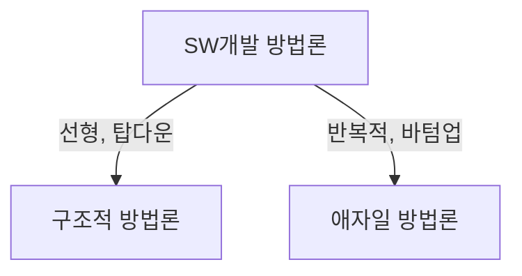

## 구조적 방법론, 애자일 방법론 개념

- 구조적방법론: 전체 시스템을 기능에 따라 분할하여 개발하고, 이를 통합하는 프로세스 중심의 하향식 방법론
- 애자일방법론: SW개발을 반복적이고 점진적으로 진행하고, 변경에 유연하게 대응하는 방법론

## 구조적 방법론, 애자일 방법론 구성요소, 주요 기법, 적용방안

### 구조적 방법론, 애자일 방법론 구성요소 비교

| 구분 | 구조적 방법론 | 애자일 방법론 |
| --- | --- | --- |
| 접근방식 | 계획중심, 단계적 | 반복적, 유연한 방식, 짧은 개발 사이클 |
| 문서화 | 모든 단계에서 상세한 문서화 | 문서보다는 동작하는 SW에 가치|
| 고객 참여 | 프로젝트 초기에 요구사항 정의 후 참여 없음 | 지속적인 피드백과 개선 |
| 변경관리 | 변경에 유연하지 않음 | 유연한 변경 수용 |
| 개발 속도 | 긴 개발 주기 | 빠른 개발 주기 |
 |장점 | 명확한 구조와 규정된 프로세스를 통한 크고 복잡한 프로젝트 적합 | 변화하는 시장 요구사항에 빠른 대응 |
 | 단점 | 유연성 부족, 계획 변경 어려움 | 문서 부족으로 인한 리스크 |
 | 주요 기법 | 데이터 흐름 다이어그램, 분할 정복, 정형화 | 스크럼, 칸반, TDD |

### 애자일 방법론의 주요 기법 스크럼, 칸반 비교

| 구분 | 스크럼 | 칸반 |
| --- | --- | --- |
| 개념 | 고정된 역할과 이벤트를 통한 작업관리 | 시각화를 통한 작업 흐름 관리 |
| 특징 | 스프린트, 데일리스크럼, 회고 | 칸반보드, 대기행렬, 총 주기 시간 |
| 장점 | 명확한 역할분담, 짧은 주기와 반복작업 | 유연한 작업관리, 지속적인 개선 |
| 단점 | 초기적응 어려움 | 역할 불명확, 관리 어려움 |

## 개발 방법론 선택시 고려사항

- 레거시시스템 여부, 팀 성숙도 측면을 고려하여 구조적 방법론과 애자일 방법론 중 선택 필요.
