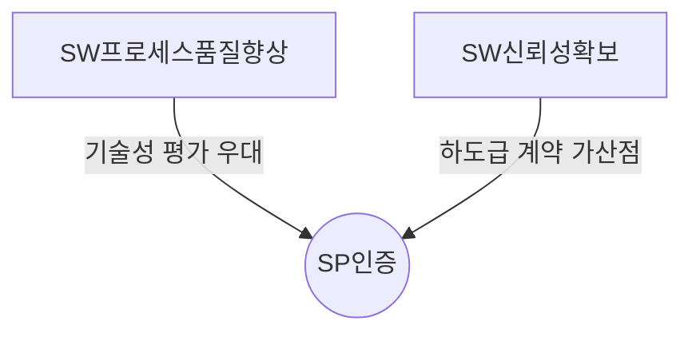
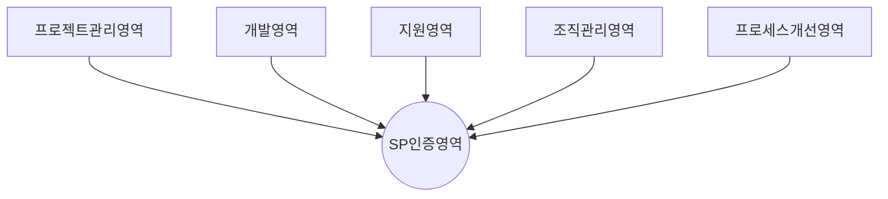

## SP인증 개념

- SW 프로세스 품질 향상과 신뢰성 확보를 위해 SW 기업 및 개발 조직의 SW 프로세스 품질 역량 수준을 심사하여 등급을 부여하는 제도

## SP 인증 개념도, 구성요소, 인증등급

### SP 인증 개념도

### SP 인증 구성요소

| 영역 | 내용 | 비고 |
|---|---|---|
| 프로젝트 관리 | 프로젝트 계획 수립, 통제, 협력업체 관리 | 계획 수립, 일정 관리, 리스크 관리 |
| 개발 | 요구사항 관리, 분석, 설계, 구현, 테스트 | 기능 명세, 코드 품질, 단위 테스트 |
| 지원 | 품질 보증, 형상 관리, 측정 및 분석 | 형상 베이스라인, QA 프로세스, 데이터 분석 |
| 조직 관리 | 조직 프로세스 관리, 구성원 교육 | 프로세스 성숙도, 교육 이수, 인재 양성 |
| 프로세스 개선 | 조직 성과 관리, 문제 해결, 프로세스 개선 관리 | 성과 지표, 지속적 개선, 프로세스 성과 |

### SP 인증등급

| 등급 | 영역 | 설명 |
| --- | --- | --- |
| 1등급 | 심사대상 아님 | 프로젝트 성공여부와 관계 없이 특정 프로젝트를 수행할 수 잇는 수준, 역량 개선 필요 |
| 2등급 | 프로젝트 관리, 개발, 지원 | 개별 프로젝트를 수행하기 위해 프로세스 수립, 이를 기반으로 프로젝트를 통제하여 성공적 수행 가능 |
| 3등급 | 프로세스 관리, 조직관리, 프로젝트 관리, 개발, 지원 | 조직 프로세스 체계 정의, 정량적인 데이터 관리로 일관된 품질 수준의 프로젝트 수행 가능, 지속적 프로세스 개선 가능 |

## SP 인증 문제점과 해결방안

| 문제점 | 해결방안 | 기대효과 |
| --- | --- | --- |
| SP인증심사 혜택 확대 | SP인증기업 프로젝트 수주 우대 등 혜택 | 참여기업증가, 제도 활성화 |
| 지속홍보 및 전문가 교육 | 지속적 심사 홍보, 기업 SW품질 담당 육성 | 인증제도 인식 확대, 역량 강화 |
| 컨설팅 등 서비스 부족 | SP인증 준비 기업 사전 지원 서비스 | 기업 어려움 완화, 인증 성공률 강화 |
| 인증 시간, 노력, 비용 부담 | SP인증 개선 토론, 설문조사 | 인증과정 효율성 향상 |
| SP인증 심사원 부족 | 기술사 등 인력풀 활용, 전문교육 | 심사원 확보로 인증 적체 해소 |
