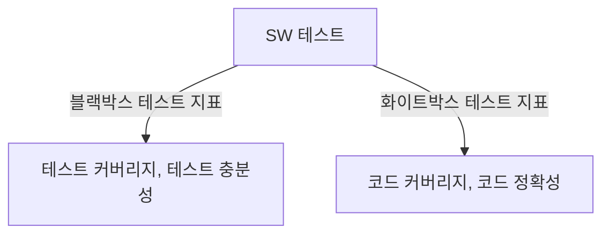

## 테스트 커버리지와 코드 커버리지의 개념

- 테스트 커버리지: SW 테스트시 얼마나 많은 기능이 테스트되었는지를 측정하는 지표
- 코드 커버리지: 코드의 각 구문이 테스트 중 얼마나 실행되었는지 측정하는 지표

## 테스트 커버리지, 코드 커버리지 구성요소, 적용방안

### 테스트 커버리지, 코드 커버리지 구성요소

| 구분 | 커버리지 | 비고 |
| --- | --- | --- |
| 테스트 커버리지 | 기능 커버리지 | 요구사항별, 유스케이스, 시나리오 |
| - | 사용자시나리오 커버리지 | UI, 통합, 시스템 |
| 코드 커버리지 | 라인 커버리지 | 코드라인, 구문, 조건 |
| - | 함수 커버리지 | 함수 호출, 함수 내부 |
| - | 분기 커버리지 | 조건, 결정, 다중 조건 |

### 테스트 커버리지, 코드 커버리지 적용방안

| 구분 | 적용방안 | 비고 |
| --- | --- | --- |
| 테스트 커버리지 | 테스트 계획 단계부터 목표 수립 | 테스트 관리도구 활용 |
| - | 테스트 실행시 커버리지 측정 보고서 작성 | - |
| 코드 커버리지 | 코드 커버리지 측정도구 활용 | 적정분석도구 통합 |
| - | 테스트 실행 후 커버리지 분석 | CI/CD 통합 |

## 커버리지 측정시 고려사항

- 비용과 시간, 테스트 품질을 고려한 현실적인 커버리지 목표 설정 필요
