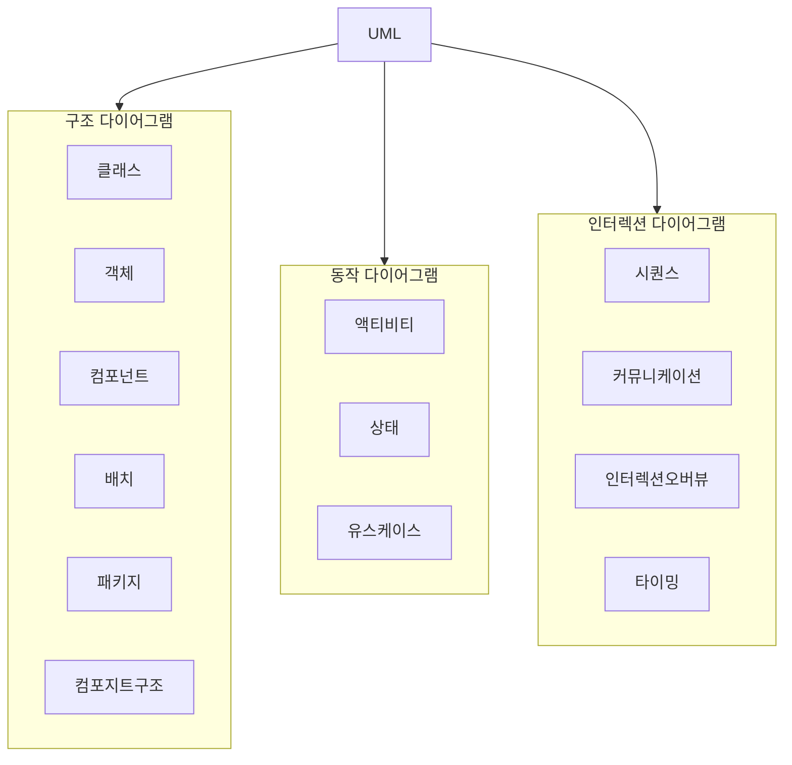
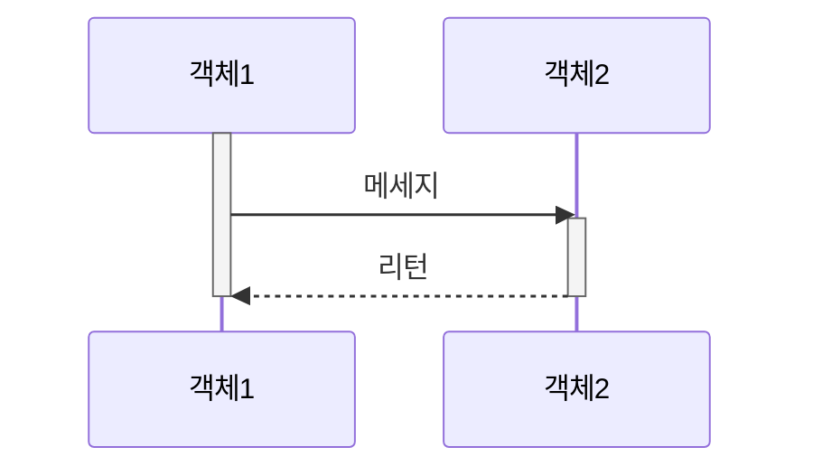
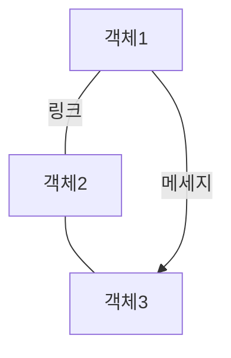

## UML 개념

- SW산출물을 가시화, 명세화, 구축, 문서화하는 도구로 구조, 동작, 인터랙션 다이어그램으로 구분

## 시퀀스 다이어그램, 커뮤니케이션 다이어그램 구성도, 구성요소, 절차

### 시퀀스 다이어그램, 커뮤니케이션 다이어그램 구성도 비교

- 시퀀스 다이어그램은 시간 순서에 따라, 커뮤니케이션 다이어그램은 구조에 따라 인터렉션 표현

### 시퀀스 다이어그램, 커뮤니케이션 다이어그램 구성요소 비교

| 구분 | 시퀀스 | 커뮤니케이션 |
| --- | --- | --- |
| 개념 | 객체 간 상호작용을 시간 흐름에 따라 메세지 표현 | 객체 간 메세지의 구조적 구성 표현 |
| 핵심요소 | 라이프라인, 액티베이션박스, 메세지 | 객체, 링크, 메세지|
| 사례 | 시스템 내부 프로세스, 실행 순서 | 시스템 아키텍처 개념적 이해 |

### 시퀀스 다이어그램, 커뮤니케이션 다이어그램 절차 비교

| 구분 | 절차 | 비고 |
| --- | --- | --- |
| 시퀀스 다이어그램 | 액터와 활성 객체 나열 | 시간순서 배치 |
| | 객체 간 메세지 작성 | 상호 작용 추가 |
| | 활성객체별 액티베이션박스 작성 | 활성화 시간 표현 |
| 커뮤니케이션 다이어그램 | 중요 객체, 클래스, 액터 식별 | 구조적 중요성 강조 |
| | 객체 및 액터 배치, 연결 | 커뮤니케이션 구조 중심 |
| | 메세지 링크 강조 | 연결성 명확화 |

## UML 작성시 고려사항

- OMG 글부 표준을 준수하여 정확성, 효용성, 유지보수성을 가진 산출물 작성
