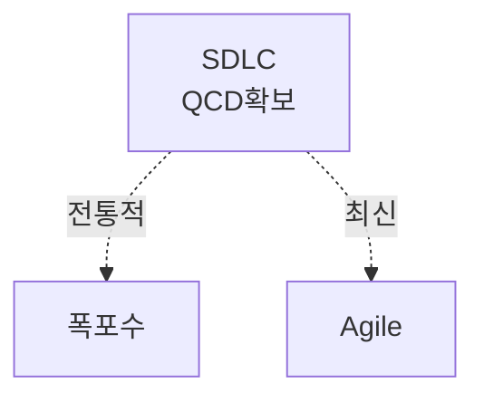

> 131/1/3

## I. 개요

### 개념

### 배경

급변하는 비지니스 요구사항과 소비자의 니즈 변화에 대응하기 위해 SDLC 와 개발 리드타임이 짧아질 필요가 있음.
전통적인 폭포수 개발 방법론은 변경에 유연하게 대응하지 못하여 애자일 개발 방법론 대두.

## II. 구조, 핵심요소, 적용방안

### 가. 구조

워터폴 그림 / 스프린트 그림

### 나. 핵심요소

| 구분         | 폭포수                                  | 애자일                                      |
| ------------ | --------------------------------------- | ------------------------------------------- |
| 요구사항기준 | 요구사항 정의시 모든 요구사항 정의 필요 | 한 스프린트 주기 (2w-1m)에 가능한 만큼 정의 |
| 테스트       | 기능 구현 후 단위/통합/시스템 테스트    | TDD 기반의 테스트 주도 개발                 |
| 프로세스     | 프로세스 준수 강조                      | 리뷰와 테스트를 토대로 유연하게 적용        |

### 다. 폭포수, 애자일 방법론의 적용방안

| 구분 | 내용                                                                                           | 비고 |
| ---- | ---------------------------------------------------------------------------------------------- | ---- |
| 공공 | 대국민 서비스는 전통적인 기능을 제공하는 경우가 많으므로 신 RFP 기반의 폭포수 개발 방법론 도입 | -    |
| 금융 | 전통적인 여신/이체 기능과 신규 서비스 기능을 나눠 두 가지 개발 방법론 선택                     | -    |
| 민간 | 비지니스 니즈에 대응하기 위해 애자일 개발 방법론 도입                                          | -    |

"끝"
