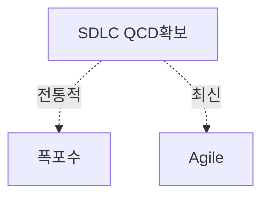

> 131/1/3

## 폭포수 방법론, 애자일 방법론의 개요

### 개념

- 폭포수 방법론: 요구사항 분석, 설계, 구현, 유지보수 과정을 순차적으로 접근하는 개발방법론
- 애자일 방법론: 고객의 다양한 니즈를 수용하기 위해 스프린트 주기 내 개발하고 변화에 대응하기 위한 개발방법론

### 배경

- 급변하는 비지니스 요구사항과 소비자의 니즈 변화에 대응하기 위해 SDLC 와 개발 리드타임이 짧아질 필요가 있음.
- 전통적인 폭포수 개발 방법론은 변경에 유연하게 대응하지 못하여 애자일 개발 방법론 대두.

## 폭포수 방법론, 애자일 방법론 개념도, 상세 비교, 적용방안

### 폭포수 방법론, 애자일 방법론 개념도

### 폭포수 방법론, 애자일 방법론 상세 비교

| 구분 | 폭포수 개발 방법론 | 애자일 개발 방법론 |
| --- | --- | --- |
| 프로세스 | 선형 순차적 모델, 단계별 완료 후 다음 단계로 진행, 큰 변경 비용 | 반복적이고 점진적인 접근, 짧은 개발 주기(스프린트)로 진행, 변경 수용 가능 |
| 도구 | 요구사항 문서, 설계 문서, 테스트 계획서 등 | 사용자 스토리, 백로그, 번다운 차트 등 |
| 기법 | 요구사항 분석, 설계, 개발, 테스트, 배포 | CI/CD, 스프린트, 스크럼, 칸반 |
| 조직 | 명확한 역할 구분(기획자, 디자이너, 개발자, 테스터) | 자율적인 팀 구성, 크로스 펑셔널 팀 |

### 폭포수, 애자일 방법론의 적용방안

| 구분 | 내용                                                                                           | 비고                      |
| ---- | ---------------------------------------------------------------------------------------------- | ------------------------- |
| 공공 | 대국민 서비스는 전통적인 기능을 제공하는 경우가 많으므로 신 RFP 기반의 폭포수 개발 방법론 도입 | 레거시어플리케이션        |
| 금융 | 전통적인 여신/이체 기능과 신규 서비스 기능을 나눠 두 가지 개발 방법론 선택                     | 복합적                    |
| 민간 | 비지니스 니즈에 대응하기 위해 애자일 개발 방법론 도입                                          | 인터넷 비지니스, 이커머스 |

인터넷 비지니스에 가까우면 애자일 개발방법론, 전통적인 기능을 제공하면 폭포수 개발방법론 적용.

## 개발방법론 적용시 고려사항

- 애자일 방법론은 팀 구성원 역량에 따라 산출물이 크게 차이나므로, 폭포수 방법론과 애자일 방법론을 결합한 하이브리드 방법론 고려 필요
