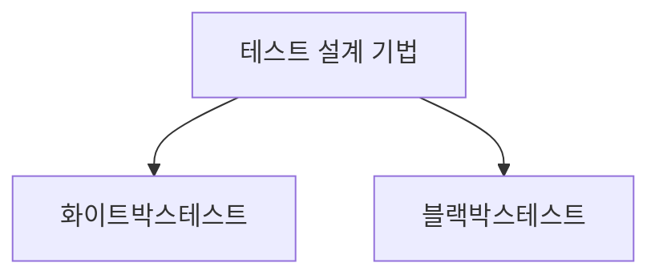

> 129/1/8

## I. 개요

### 개념

### 배경

테스트 V모델에서 요구사항/분석/설계/코딩 측면은 개발자 관점의 화이트박스 테스트로 Verification 하고,
단위/통합/시스템/사용자 테스트 측면은 사용자 관점의 블랙박스 테스트로 Validation 하게 설계 필요.

## II. 구조, 핵심요소, 적용방안

### 가. 구조 (구성도, 개념도)

### 나. 핵심요소

가.에 그린 다이어그램을 3단 표로 작성

| 구분 | 내용 | 비고 |
| ---- | ---- | ---- |
| -    | -    | -    |

### 다. 적용방안

| 구분          | 내용 | 비고 |
| ------------- | ---- | ---- |
| 비지니스 관점 | -    | -    |
| 기술 관점     | -    | -    |
| 보안 관점     | -    | -    |

"끝"
