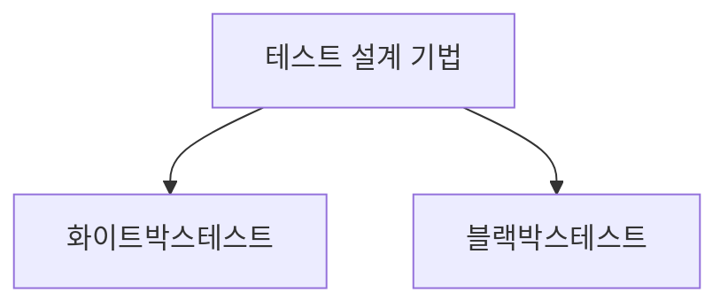

> 129

## 화이트박스, 블랙박스 테스트 개요

### 화이트박스, 블랙박스 테스트 개념

### 화이트박스, 블랙박스 테스트 배경

- 테스트 V모델에서 요구사항/분석/설계/코딩 측면은 개발자 관점의 화이트박스 테스트로 Verification 하고,
- 단위/통합/시스템/사용자 테스트 측면은 사용자 관점의 블랙박스 테스트로 Validation 하게 설계 필요.

## 화이트박스, 블랙박스 테스트 개념도, 핵심요소, 적용방안

### 화이트박스, 블랙박스 테스트 개념도

- 내부구조를 파악하는지 여부에 따라 기법 변경

### 화이트박스, 블랙박스 테스트 핵심요소

| 구분 | 화이트박스 | 블랙박스 |
| ---- | ---- | ---- |
| 테스트기반    | 소스코드, 제어흐름그래프    | 요구사항명세서, 유스케이스    |
| 테스트설계 | 문장커버리지, 결정커버리지, 조건커버리지, 경로커버리지 | 동등분할, 경계값 분석, 오류추정, 원인/결과 분석 |
| 테스트목표 | 코드의 정확성, 안정성, 완전성 검증 | 기능요구사항 충족여부, UX 및 시스템 동작 검증 |
| 테스트시점 | 개발 초기 단계 | 개발 후반 단계 |
| 테스트자동화 | JUnit, Jest 등 단위테스트 프레임워크 | Selenium, Playwright 등 UI테스트 프레임워크 |
| 장점 | 숨겨진 결함 발견 용이, 테스트 커버리지 향상 | 사용자 관점 검증, 비교적 쉬운 TC 설계 |
| 단점 | 높은 비용, 시간 소모, 코드 변경시 TC 수정 필요 | 숨겨진 결합 발견 어려움, 낮은 TC 커버리지 |

### 화이트박스, 블랙박스 테스트 적용방안

| 구분          | 화이트박스 | 블랙박스 |
| ------------- | ---- | ---- |
| 단위테스트 | 각 함수, 모듈 기능 검증    | 없음    |
| 통합테스트     | 모듈간 인터페이스 상호작용 검증   | 여러 모듈 통합 후 기능 검증    |
| 시스템테스트    | 없음    | 전체 시스템 기능, 성능 검증    |

## 테스트시 고려사항

- 화이트박스와 블랙박스 테스트의 장점을 결합하여 제한적 내부 정보를 활용한 그레이박스 테스트 기법 고려
