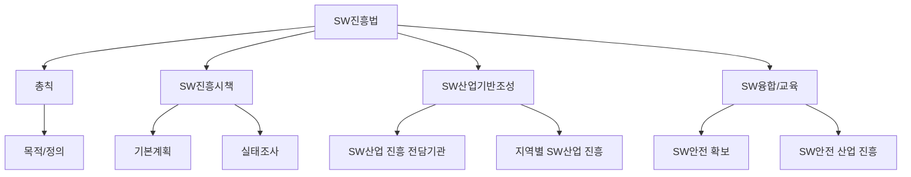
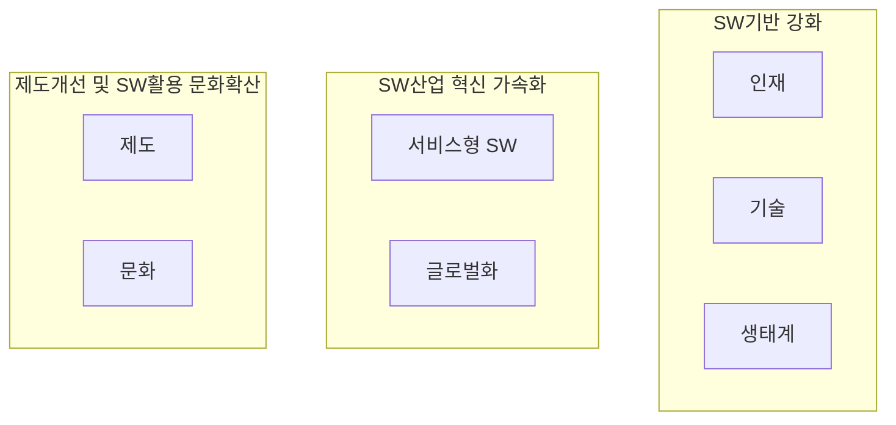

## 소프트웨어 진흥법 개념

- 국가 전반의 소프트웨어 역량을 강화하고 소프트웨어산업 발전의 기반을 조성함으로써 국가경쟁력의 확보, 국민생활의 향상 및 국민경제의 건전하고 지속적인 발전에 기여

## 소프트웨어 안전 확보 지침

| 구분 | 지침 | 세부 내용 |
| --- | --- | --- |
| 위험 분석 | 소프트웨어 안전 위험 분석 | - 소프트웨어의 잠재적 위험요소 식별 - 시스템 동작 시 발생 가능한 오류와 영향을 분석 - 위험 완화를 위한 우선순위 설정 |
| 설계 및 구현 | 안전 설계 및 구현 | - 안전 관련 기능 설계 (예: 결함 허용, 오류 복구) - 코드의 안전성 확보를 위한 코딩 표준 준수 - 위험 상황 식별 및 대응 로직 포함 |
| 검증 | 안전 검증 및 테스트 | - 안전 요구사항 충족 여부 검증 - 단위 테스트, 통합 테스트, 시스템 테스트를 통해 오류 검출 - 안전 관련 기능 시험 및 검토 |
| 운영 관리 | 운영 환경에서의 안전 확보 | - 운영환경 변경 시 안전 영향 분석 - 장애 발생 대비 안전 대책 수립 - 유지보수 중 발생 가능한 위험 관리 |
| 준수 및 개선 | 안전 준수와 지속적 개선 | - 국제표준과 안전 지침 준수 - 안전사고 예방을 위한 프로세스 개선 - 피드백을 반영하여 안전성 강화 |

## 소프트웨어 진흥 전략

- 디지털 시대를 선도, 글로벌 SW 경쟁력 강화, SW 활용 문화 확대를 위해 7가지 분야에서 혁신 필요

## 참조

- [국가법령정보센터: 소프트웨어 진흥법](https://law.go.kr/%eb%b2%95%eb%a0%b9/%ec%86%8c%ed%94%84%ed%8a%b8%ec%9b%a8%ec%96%b4%ec%a7%84%ed%9d%a5%eb%b2%95)
