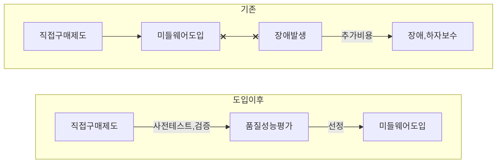

## 소프트웨어 품질성능평가 개념

- 동종의 경쟁제품간 비교시험을 통해 SW 구매자의 요구사항을 만족하고 품질 및 성능이 우수한 제품을 선정하는 시험
- 공공 및 민간 부문 SW구매 결정의 신뢰성 제고, 비용절감

## 소프트웨어 품질성능평가 개념도, 대상

### 소프트웨어 품질성능평가 개념도

- 품질성능평가 후 SW 도입으로 안정성 증가

### 소프트웨어 품질성능평가 적용 및 제외대상

| 적용대상 | 제외대상 |
| --- | --- |
| 구매금액 1억 이상 상용 소프트웨어 | 조달청 쇼핑몰 등록 제품 |
| 직접구매제외대상인 경우, 구매금액 2억 이상 상용 소프트웨어 | 정보보호제품 성능평가를 통과한 소프트웨어 |

### 소프트웨어 품질 성능 평가 절차

## 소프트웨어 평가시험 대상 소프트웨어 분야

| 구분 | 분야 | 내용 |
| --- | --- | --- |
| 시스템SW | 통신SW | 논리적 망분리, 망연계SW |
| - | 유틸리티SW | 화상회의, OCR |
| - | 시스템관리SW | 시스템관리, NW관리, APM, AI플랫폼 |
| - | 정보보호SW | DB, 보안, 접근제어, 개인정보SW |
| - | 미들웨어SW | WAS, WEB서버, 가상화, 검색 |
| 개발용SW | 데이터관리용SW | DBMS, OLAP, 메타데이터 관리 |
| 응용SW | 기업관리SW | 전자문서관리(EDMS) |
| - | GIS SW | GIS |
| - | 기타 응용SW | 자연어처리, 분배 관리 |

## 소프트웨어 품질성능 평가시 고려사항

- ISO 25000 시리즈를 참조하여 평가항목 선정 필요
