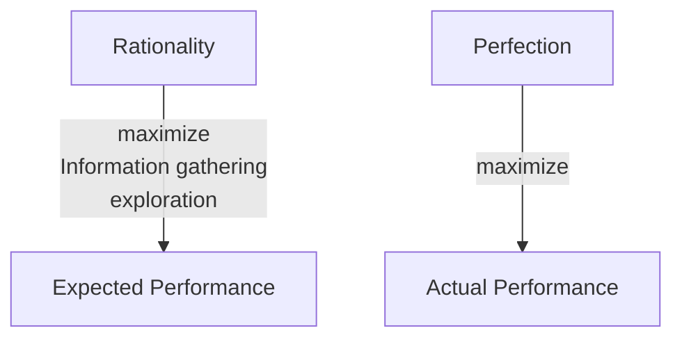

## Vocabulary & Expressions

| Term/Expression | Definition | Simpler Paraphrase | Meaning |
| --- | --- | --- | --- |
| [perceive](https://dictionary.cambridge.org/dictionary/english/perceive) | To become aware of something through the senses | To notice or become aware of | 인식하다 |
| [crude](https://dictionary.cambridge.org/dictionary/english/crude) | In a raw or unrefined state; lacking sophistication | Basic or rough; not polished | 조잡한, 대충만든 |
| [flesh out](https://dictionary.cambridge.org/dictionary/english/flesh-out) | To add more details or substance to an idea or plan | To develop or expand an idea with more information | 구체화하다, 자세히 설명하다 |
| [infrared](https://dictionary.cambridge.org/dictionary/english/infrared) | Relating to electromagnetic radiation with wavelengths longer than visible light | A type of light that is not visible to the human eye, often used in technology | 적외선의 |
| [In practice](https://dictionary.cambridge.org/dictionary/english/in-practice) | In reality or in actual use, as opposed to theory | How something works in real life, not just in theory | 실제로, 실제 사용에서 |
| [percept](https://dictionary.cambridge.org/dictionary/english/percept) | A mental impression or understanding formed by the senses | An idea or understanding formed by what we see, hear, etc. | 지각, 인식 |
| percept sequence | The complete history of everything the agent has ever perceived | The full record of all the things an agent has noticed or experienced | 지각 순서, 인식의 연속 |
| [tabulate](https://dictionary.cambridge.org/dictionary/english/tabulate) | To arrange data in a table format for easier analysis | To organize information into a table | 표로 정리하다 |
| [artifact](https://dictionary.cambridge.org/dictionary/english/artifact) | An object made or used by humans, often of historical or cultural interest | A human-made object, especially one of historical or cultural significance | 인공물, 유물 |
| [consequentialism](https://dictionary.cambridge.org/dictionary/english/consequentialism) | An ethical theory that judges actions by their outcomes or consequences | A moral philosophy that evaluates actions based on their results | 결과주의 |
| [desirability](https://dictionary.cambridge.org/dictionary/english/desirability) | The quality of being desirable or wanted | How much something is wanted or valued | 바람직함, 선호도 |
| [knotty](https://dictionary.cambridge.org/dictionary/english/knotty) | Complex and difficult to solve or understand | Complicated and challenging | 복잡한, 어려운 |
| [criterion](https://dictionary.cambridge.org/dictionary/english/criterion) | A standard or principle by which something is judged or decided | A rule or standard used to evaluate something | 기준, 표준 |
| [prior](https://dictionary.cambridge.org/dictionary/english/prior) | Existing or occurring before something else | Something that comes before or is earlier in time | 이전의, 선행하는 |
| [oscillate](https://dictionary.cambridge.org/dictionary/english/oscillate) | To move back and forth in a regular rhythm; to vary between two points | To swing or fluctuate between two states or values | 진동하다, 오락가락하다 |
| [omniscience](https://dictionary.cambridge.org/dictionary/english/omniscience) | The state of having complete or unlimited knowledge | The ability to know everything | 전지전능, 모든 것을 아는 상태 |
| [pantomime](https://dictionary.cambridge.org/dictionary/english/pantomime) | A form of theatrical performance using gestures and body movements without spoken words | A performance that tells a story through actions and expressions, not speech | 무언극, 몸짓극 |
| [wasp](https://dictionary.cambridge.org/dictionary/english/wasp) | A type of stinging insect known for its slender body and aggressive behavior | A flying insect that can sting, often yellow and black | 말벌 |
| [entomologist](https://dictionary.cambridge.org/dictionary/english/entomologist) | A scientist who studies insects | An expert in the study of insects | 곤충학자 |
| [innate](https://dictionary.cambridge.org/dictionary/english/innate) | Existing naturally or as part of something; not learned or acquired | Something that is inborn or inherent | 타고난, 선천적인 |
| To the extent | As far as something is true or applicable | To the degree that something is relevant or valid | ~의 범위 내에서, ~에 한해서, ~한 정도까지는 |
| [reflex](https://dictionary.cambridge.org/dictionary/english/reflex) | An automatic, involuntary response to a stimulus | A quick, instinctive reaction to something | 반사 작용, 반사 신경 |
| acronymically | In a way that uses the first letters of words to form an abbreviation | Using the initial letters of words to create a shorter form | 약어로, 두문자어로 |
| [aspire](https://dictionary.cambridge.org/dictionary/english/aspire) | To have a strong desire or ambition to achieve something | To aim for or seek to achieve a goal | 열망하다, 갈망하다 |
| [disturbance](https://dictionary.cambridge.org/dictionary/english/disturbance) | An interruption or disruption of normal activity or state | A disturbance is something that disrupts or interrupts | 방해, 소란 |
| [alley](https://dictionary.cambridge.org/dictionary/english/alley) | A narrow passageway between buildings or walls | A small street or path, often for pedestrians | 골목, 좁은 길 |
| [speedometer](https://dictionary.cambridge.org/dictionary/english/speedometer) | An instrument that measures the speed of a vehicle | A device that shows how fast a vehicle is going | 속도계 |
| [accelerometer](https://dictionary.cambridge.org/dictionary/english/accelerometer) | An instrument that measures acceleration or changes in speed | A device that detects how quickly something speeds up or slows down | 가속도계 |
| [persistent](https://dictionary.cambridge.org/dictionary/english/persistent) | Continuing firmly or obstinately in a course of action despite difficulty or opposition | Continuing to exist or endure over a long period | 지속적인, 끈질긴 |
| [embody](https://dictionary.cambridge.org/dictionary/english/embody) | To give tangible or visible form to an idea, quality, or feeling | To represent or express something in a physical form | 구체화하다, 구현하다 |
| [explicitly](https://dictionary.cambridge.org/dictionary/english/explicitly) | In a clear and detailed manner, leaving no room for confusion | Clearly stated or shown, without ambiguity | 명확하게, 분명히 |
| [daunting](https://dictionary.cambridge.org/dictionary/english/daunting) | Intimidating or discouraging; causing one to lose confidence | Making someone feel less confident or more afraid | 벅찬, 위협적인, 겁먹게 하는 |

## Agents

- Simple reflex agents
- Model-based reflex agents
- Goal-based agents
- Utility-based agents
